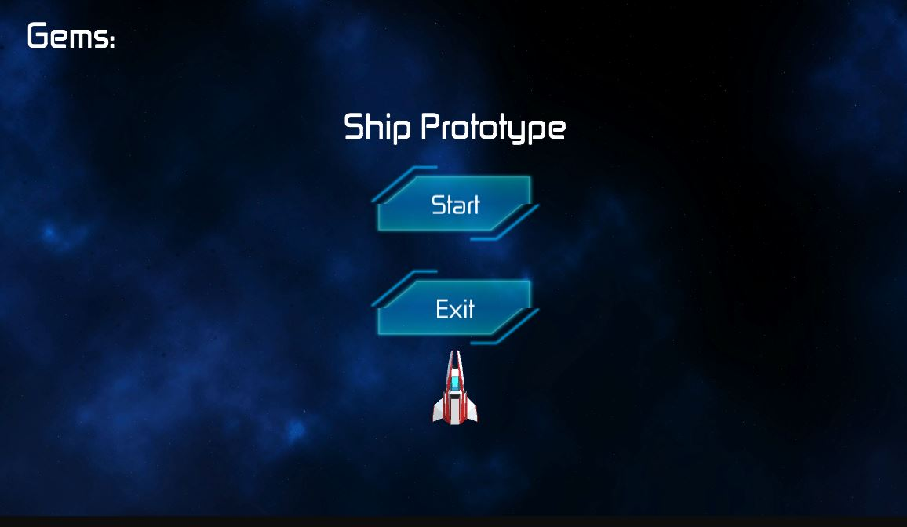
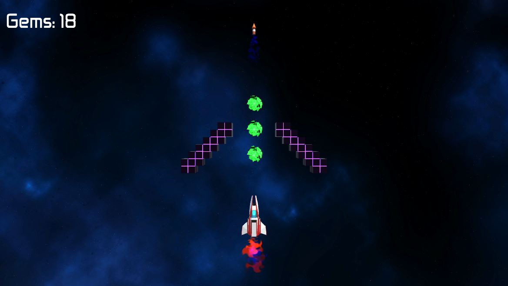

# ShipPrototype
My pet project in Unity. I did it all myself from scratch. This was created after finishing the Junior Programmer Pathway.

Link to WebGL building: https://play.unity.com/mg/other/webgl-builds-181071
## Screenshot

____

## Features
+ Data Persistence (Gem Score)
+ Sound
+ VFX
